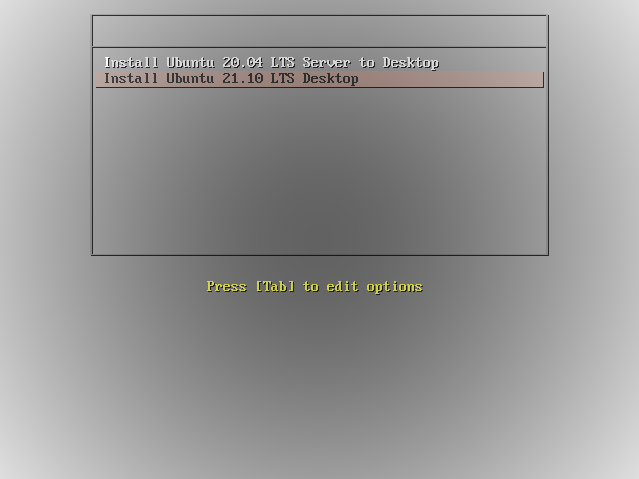

- [Ambiente](#Ambiente)
- [Introdução](#Introdução)
- [Instalar o servidor PXE - Pre-Execution Environment](##Instalar_o_servidor_PXE_-_Pre-Execution_Environment)
- [Configurar o TFTP](###Configurar_o_TFTP)
- [Configure o dhcp server](###Configure_o_dhcp_server)
- [Baixando a ISO](###Baixando_a_ISO)
- [Configurar o NFS](###Configurar_o_NFS)
- [Configuração do PXE](###Configuração_do_PXE)
- [Instalação personalizada](##Instalação_personalizada)
- [Instalar o servidor PXE - Pre-Execution Environment](###Instalar_o_servidor_PXE)
- [Configurar o TFTP](###Configurar_o_TFTP)
- [Configure o dhcp server](###Configure_o_dhcp_server)
- [Baixando a ISO](###Baixando_a_ISO)
- [Configurar o NFS](###Configurar_o_NFS)
- [Configuração do PXE](###Configuração_do_PXE)

# Ambiente

Vamos montar o servidor PXE usando algumas medidas de segurança, o servidor vai ter 2 interfaces de rede, uma interface para cada rede, uma das conexões vai ser para acesso na internet e a outra vai ser para comunicação com o os servidores da rede *pxe*. 

Com isso, vamos habilitar o daemon do DHCP para escutar apenas na interface da rede do pxe assim como o daemon do tftp, ambos escutarão apenas na rede pxe.


A primeira instalação vai mostrar o método mais simples para subir um servidor pxe manual (existem algumas aplicações que sobem o servidor pxe como o **cobbler**), logo mais vamos fazer uma customização do servidor pxe, usando menu em boot para escolher qual sistema subir via pxe.


# Introdução

PXELINUX é um derivado do Syslinux, usado para inicializar o Linux fora de um servidor de rede, usando uma ROM de rede em conformidade com a especificação Intel PXE (Pre-Execution Environment). O arquivo do pxelinux em sí é um bootloader para Linux que usa o protocolo de inicialização de rede PXE.


Existem alguma formas de configurar o "serviço do pxe", como expecificar o arquivo de configuração baseado no MAC do servidor cliente a nível de camada 1, apesar de não ser muito complicado, usar o arquivo padrão para isso é muito mais fácil e prático, permitindo uma configuração que todos entendam e consigam dar manutenção rapidamente.


Para que o servidor pxe funcione, precisamos que algumas aplicações funcionem em conjunto; para que o nosso servidor pxe possa funcionar. Essas aplicações são (obrigatoriamente): DHCP, TFTP, NFS ou HTTP. 

O que vai mudar é o método de configuração dependendo da aplicação escolhida, por exemplo, se usado o DHCP do ISC, o método de configuração do DHCP vai ser diferente se usado o DHCP do DNSMASQ, a configuração do TFTPD é relativamente diferente do ATFTP e do TFTPD-HPA, e assim por diante, nos exemplos a seguir vamos usar o `tftpd-hpa, isc-dhcp-server e NFS`, não vou usar o pxe via http por uma questão de escolha, mas isso cabe ao gosto do freguês, assim como qual serviço de `tftp` usar.


## Instalar_o_servidor_PXE_-_Pre-Execution_Environment

Vamos começar instalando os pacotes necessários para o funcionamento do pxelinux:

```bash
# Instalar as aplicações para o pxe server:
sudo apt install isc-dhcp-server nfs-kernel-server tftpd-hpa pxelinux -y

# isc-dhcp-server = Servidor DHCP;
# nfs-kernel-server = Servidor NFS;
# tftpd-hpa = Servidor TFTP-HPA;
# pxelinux = Pacote que contém os arquivos do PXE.

# Apenas para testar o TFTP, podemos instalar o pacote tftp-hpa.
```


### Configurar_o_TFTP

Agora vamos configurar o daemon do tftpd para que ele possa fornecer os arquivos durante o boot.

```bash
# Edite o arquivo de configuração do tftpd:
sudo vim /etc/default/tftpd-hpa

###### Deixe como abaixo, mudando o necessário ######
TFTP_USERNAME="tftp"
TFTP_DIRECTORY="/srv/tftp"
TFTP_ADDRESS="192.168.100.2:69"
TFTP_OPTIONS="--secure"

# Você logo pode ver a diferença entre o meu arquivo e o seu, 
# no meu foi modificado a pasta raiz do tftp e ao invés de deixar ele 
# escutando em todas as interfaces, eu pedi para que ele escute apenas 
# na interface 'enp0s8' que tem o IP '192.168.100.2'.

# Veja abaixo o ip na interface:
sudo ip addr show enp0s8
3: enp0s8: <BROADCAST,MULTICAST,UP,LOWER_UP> mtu 1500 qdisc pfifo_fast state UP group default qlen 1000
    link/ether 08:00:27:54:a2:67 brd ff:ff:ff:ff:ff:ff
    inet 192.168.100.2/24 brd 192.168.100.255 scope global enp0s8
       valid_lft forever preferred_lft forever
    inet6 fe80::a00:27ff:fe54:a267/64 scope link 
       valid_lft forever preferred_lft forever
       
# Agora vamos criar a pasta do tftp:
sudo mkdir -p /srv/tftp

# Agora reinicie o serviço do tftpd e verifique o status:
sudo systemctl restart tftpd-hpa.service
sudo systemctl status tftpd-hpa.service
```

 

### Configure_o_dhcp_server

Agora vamos configurar o servidor DHCP, para uma configuração básica do dhcp, podemos usar o exemplo que está no arquivo `/usr/share/doc/pxelinux/README.txt.gz` caso você tenha o pacote `pxelinux` instalado, nosso exemplo foi baseado nesse arquivo, mudando apenas algumas coisas.

```bash
default-lease-time 600;
max-lease-time 7200;

allow booting;
allow bootp;

authoritative;
ignore client-updates;

log-facility local7;

subnet 192.168.100.0 netmask 255.255.255.0 {
    range dynamic-bootp        192.168.100.20 192.168.100.253;
    option broadcast-address   192.168.100.255;
    option routers             192.168.100.2;
    option domain-name-servers 8.8.8.8;
    option subnet-mask         255.255.255.0;
    default-lease-time         21600;
    max-lease-time             43200;
}

 
group {
   next-server 192.168.100.2;

   host teste {
      # Coloque o MAC da máquina cliente aqui em baixo!
      hardware ethernet 52:54:00:20:35:ac;
      fixed-address 192.168.100.177;
      # Graças ao CHROOT usado pelo tftp-hpa, não precisamos colocar o caminho
      # completo para o arquivo PXELINUX, pois o mesmo está no diretório raiz
      # do tftp, caso contrário precisa colocar.
      filename "pxe5254";

   }
}

## Agora vamos configurar a interface do dhcp que ele vai ficar escutando
# Edite o arquivo abaixo:
sudo vim /etc/default/isc-dhcp-server

# Em INTERFACES, coloque o nome da interface que o daemon vai escutar, no meu caso
# a interface é 'enp0s8', segue meu exemplo:
INTERFACES="enp0s8"


# Agora reinicie o DHCP e veja o status do serviço:
sudo systemctl restart isc-dhcp-server
sudo systemctl status isc-dhcp-server
```

 

### Baixando_a_ISO

Agora vamos baixar a imagem do sistema que será instalada pela rede e vamos criar uma pasta onde vamos deixar os arquivos da ISO para que possam ser disponibilizados via NFS:

```bash
# Crie a pasta onde vamos colocar a ISO (descompactada):
sudo mkdir -p /distros/ubuntu2004

# Baixe a ISO, no nosso caso será uma uma imagem do Ubuntu 20.04 
wget https://cdimage.ubuntu.com/ubuntu-server/focal/daily-live/current/focal-live-server-amd64.iso

# Agora vamos montar a imagem em /mnt:
sudo mount focal-live-server-amd64.iso /mnt/

# Agora copie tudo da pasta /mnt para a pasta /distros/ubuntu2004
sudo find /mnt -maxdepth 1 -not -wholename "/mnt" -exec cp -Rv {} /distros/ubuntu2004/ \;
```


### Configurar_o_NFS

Agora vamos compartilhar a pasta onde está nossa imagem do Ubuntu para que ela seja disponibilizada durante o boot:


```bash
# Edite o arquivo:
sudo vim /etc/exports

# Deixe como abaixo:
/distros/ubuntu2004       *(rw,sync,no_subtree_check)


# Exporte a configuração do NFS
sudo exportfs -a
```


### Configuração_do_PXE

Toda a configuração do pxe (arquivos e binários) é colocada dentro do tftp, para que assim o tftp possa fornecer os arquivos como pxelinux.0, initrd, vmlinuz entre outros.

```bash
## Crie a pasta para colocarmos o pxelinux.0:
sudo mkdir /srv/tftp/pxe/

## Vamos pegar o pxelinux.0:
sudo cp -v /usr/lib/PXELINUX/pxelinux.0 /srv/tftp/pxe/

## Crie a pasta onde colocaremos o arquivo de configuração padrão:
sudo mkdir /srv/tftp/pxelinux.cfg

## Crie o arquivo de configuração padrão:
sudo touch /srv/tftp/pxelinux.cfg/default

## Edite o arquivo:
sudo vim /srv/tftp/pxelinux.cfg/default

#### Coloque a informação abaixo: #### 
default install
prompt 0
timeout 1
label install
    menu label Install
    kernel vmlinuz
    append initrd=initrd ip=dhcp nfsroot=192.168.100.2:/distros/ubuntu2004 netboot=nfs ---


## Vamos colar a imagem do kernel e o initrd:
sudo cp /mnt/casper/{vmlinuz,initrd} /srv/tftp/

# Agora vamos copiar para o tftp o arquivo de bios simples:
sudo cp -v /usr/lib/syslinux/modules/bios/ldlinux.c32 /srv/tftp/

## Crie o link para o pxelinux.0 na raiz do tftp:
sudo ln -sf pxe/pxelinux.0 /srv/tftp/pxe5254
```


## Instalação_personalizada

Vamos instalar agora o pxe num modelo onde podemos configurar vários sistemas para boot, e quem escolhe qual sistema iniciar é quem está inicializando o sistema. Para evitar problemas vamos configurar do zero todos os passos, apenas alterando o que for necessário.


### Instalar_o_servidor_PXE

Vamos começar instalando os pacotes necessários para o funcionamento do pxelinux:

```bash
# Instalar as aplicações para o pxe server:
sudo apt install isc-dhcp-server nfs-kernel-server tftpd-hpa pxelinux -y

# isc-dhcp-server = Servidor DHCP;
# nfs-kernel-server = Servidor NFS;
# tftpd-hpa = Servidor TFTP-HPA;
# pxelinux = Pacote que contém os arquivos do PXE.

# Apenas para testar o TFTP, podemos instalar o pacote tftp-hpa.
```


### Configurar_TFTP

Agora vamos configurar o daemon do tftpd para que ele possa fornecer os arquivos durante o boot.

```bash
# Edite o arquivo de configuração do tftpd:
sudo vim /etc/default/tftpd-hpa

###### Deixe como abaixo, mudando o necessário ######
TFTP_USERNAME="tftp"
TFTP_DIRECTORY="/srv/tftp"
TFTP_ADDRESS="192.168.100.2:69"
TFTP_OPTIONS="--secure"

# Você logo pode ver a diferença entre o meu arquivo e o seu, 
# no meu foi modificado a pasta raiz do tftp e ao invés de deixar ele 
# escutando em todas as interfaces, eu pedi para que ele escute apenas 
# na interface 'enp0s8' que tem o IP '192.168.100.2'.

# Veja abaixo o ip na interface:
sudo ip addr show enp0s8
3: enp0s8: <BROADCAST,MULTICAST,UP,LOWER_UP> mtu 1500 qdisc pfifo_fast state UP group default qlen 1000
    link/ether 08:00:27:54:a2:67 brd ff:ff:ff:ff:ff:ff
    inet 192.168.100.2/24 brd 192.168.100.255 scope global enp0s8
       valid_lft forever preferred_lft forever
    inet6 fe80::a00:27ff:fe54:a267/64 scope link 
       valid_lft forever preferred_lft forever
       
# Agora vamos criar a pasta do tftp:
sudo mkdir -p /srv/tftp

# Agora reinicie o serviço do tftpd e verifique o status:
sudo systemctl restart tftpd-hpa.service
sudo systemctl status tftpd-hpa.service
```

 

### Configurando_DHCP_Server

Agora vamos configurar o servidor DHCP, para uma configuração básica do dhcp, podemos usar o exemplo que está no arquivo `/usr/share/doc/pxelinux/README.txt.gz` caso você tenha o pacote `pxelinux` instalado, nosso exemplo foi baseado nesse arquivo, mudando apenas algumas coisas.

```bash
default-lease-time 600;
max-lease-time 7200;

allow booting;
allow bootp;

authoritative;
ignore client-updates;

log-facility local7;

subnet 192.168.100.0 netmask 255.255.255.0 {
    range dynamic-bootp        192.168.100.20 192.168.100.253;
    option broadcast-address   192.168.100.255;
    option routers             192.168.100.2;
    option domain-name-servers 8.8.8.8;
    option subnet-mask         255.255.255.0;
    default-lease-time         21600;
    max-lease-time             43200;
}

 
group {
   next-server 192.168.100.2;

   host teste {
      # Coloque o MAC da máquina cliente aqui em baixo!
      hardware ethernet 52:54:00:20:35:ac;
      fixed-address 192.168.100.177;
      # Graças ao CHROOT usado pelo tftp-hpa, não precisamos colocar o caminho
      # completo para o arquivo PXELINUX, pois o mesmo está no diretório raiz
      # do tftp, caso contrário precisa colocar.
      filename "pxe5254";

   }
}

## Agora vamos configurar a interface do dhcp que ele vai ficar escutando
# Edite o arquivo abaixo:
sudo vim /etc/default/isc-dhcp-server

# Em INTERFACES, coloque o nome da interface que o daemon vai escutar, no meu caso
# a interface é 'enp0s8', segue meu exemplo:
INTERFACES="enp0s8"


# Agora reinicie o DHCP e veja o status do serviço:
sudo systemctl restart isc-dhcp-server
sudo systemctl status isc-dhcp-server
```

 

### Baixando_ISO

Agora vamos baixar a imagem do sistema que será instalada pela rede e vamos criar uma pasta onde vamos deixar os arquivos da ISO para que possam ser disponibilizados via NFS:

```bash
# Crie a pasta onde vamos colocar a ISO (descompactada):
sudo mkdir -p /distros/ubuntu2004

# Baixe a ISO, no nosso caso será uma uma imagem do Ubuntu 20.04 
wget https://cdimage.ubuntu.com/ubuntu-server/focal/daily-live/current/focal-live-server-amd64.iso

# Agora vamos montar a imagem em /mnt:
sudo mount focal-live-server-amd64.iso /mnt/

# Agora copie tudo da pasta /mnt para a pasta /distros/ubuntu2004
sudo find /mnt -maxdepth 1 -not -wholename "/mnt" -exec cp -Rv {} /distros/ubuntu2004/ \;

# Crie a pasta onde vamos colocar a ISO (descompactada):
sudo mkdir /srv/tftp/ubuntu2004

## Vamos colar a imagem do kernel e o initrd:
sudo cp -v /mnt/casper/{vmlinuz,initrd} /srv/tftp/ubuntu2004/

## Desmonte o ISO:
sudo umount /mnt/
```


Agora vamos fazer isso com outra imagem:

```bash
# Crie a pasta onde vamos colocar a ISO (descompactada):
sudo mkdir -p /distros/ubuntu21_desktop

# Baixe a ISO, no nosso caso será uma uma imagem do Ubuntu 20.04 
wget https://cdimage.ubuntu.com/ubuntu/daily-live/current/hirsute-desktop-amd64.iso

# Agora vamos montar a imagem em /mnt:
sudo mount hirsute-desktop-amd64.iso /mnt/

# Agora copie tudo da pasta /mnt para a pasta /distros/ubuntu2004
sudo find /mnt -maxdepth 1 -not -wholename "/mnt" -exec cp -Rv {} /distros/ubuntu21_desktop/ \;

# Crie a pasta onde vamos colocar a ISO (descompactada):
sudo mkdir /srv/tftp/ubuntu21_desktop

## Vamos colar a imagem do kernel e o initrd:
sudo cp -v /mnt/casper/{vmlinuz,initrd} /srv/tftp/ubuntu21_desktop/
```


### Configurarando_NFS

Agora vamos compartilhar a pasta onde está nossa imagem do Ubuntu para que ela seja disponibilizada durante o boot:


```bash
# Edite o arquivo:
sudo vim /etc/exports

# Deixe como abaixo:
/distros/       *(rw,sync,no_subtree_check)


# Exporte a configuração do NFS
sudo exportfs -a
```


### Configurando_PXE

Toda a configuração do pxe (arquivos e binários) é colocada dentro do tftp, para que assim o tftp possa fornecer os arquivos como pxelinux.0, initrd, vmlinuz entre outros.

```bash
## Crie a pasta para colocarmos o pxelinux.0:
sudo mkdir /srv/tftp/pxe/

## Vamos pegar o pxelinux.0:
sudo cp -v /usr/lib/PXELINUX/pxelinux.0 /srv/tftp/pxe/

## Crie a pasta onde colocaremos o arquivo de configuração padrão:
sudo mkdir /srv/tftp/pxelinux.cfg

## Crie o arquivo de configuração padrão:
sudo touch /srv/tftp/pxelinux.cfg/default

## Edite o arquivo:
sudo vim /srv/tftp/pxelinux.cfg/default

#### Coloque a informação abaixo: #### 
default vesamenu.c32

label install1
menu label ^Install Ubuntu 20.04 LTS Server to Desktop
menu default
kernel ubuntu2004/vmlinuz
append initrd=ubuntu2004/initrd ip=dhcp boot=casper netboot=nfs nfsroot=192.168.100.2:/distros/ubuntu2004/ ---

label install2
menu label ^Install Ubuntu 21.10 LTS Desktop
menu default
kernel ubuntu21_desktop/vmlinuz
append initrd=ubuntu21_desktop/initrd ip=dhcp boot=casper netboot=nfs nfsroot=1192.168.100.2:/distros/ubuntu21_desktop/ ---

# Agora vamos copiar para o tftp os arquivos de bios e menus necessários
# para criar o "grub" do pxe:
sudo cp -v  /usr/lib/syslinux/modules/bios/{ldlinux.c32,libcom32.c32,libutil.c32,vesamenu.c32} /srv/tftp/

## Crie o link para o pxelinux.0 na raiz do tftp:
sudo ln -sf pxe/pxelinux.0 /srv/tftp/pxe5254
```


Abaixo segue uma foto de como é o "grub" do pxe que acabamos de configurar usando o módulo `vesamenu.c32`.


